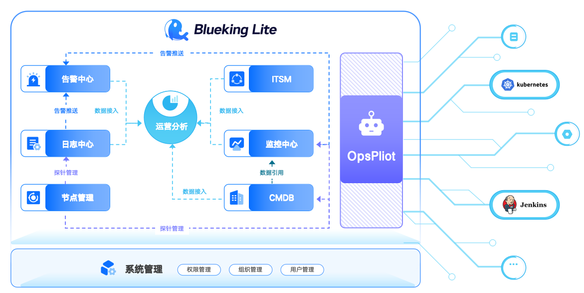

# Blueking Lite

   

---
## 📖 简介

Blueking Lite 是一个 **AI First** 的**轻量版**运维产品，具有部署资源要求低、使用成本低、渐进式体验等特点，为运维管理员提供日常运维中的必备工具。

### 🌐 在线体验

- **快速体验**: https://bklite.canway.net （微信扫码登录）
- **英文文档**: [English Documents Available](readme_en.md)
- **极速安装**: `curl -sSL https://bklite.ai/install.run| bash -`
- 
### 💬 交流群

---

## 📋 项目概览

- 📝 [设计理念](docs/overview/design.md)
- 🏗️ [架构设计](docs/overview/architecture.md)
- 📁 [代码目录](docs/overview/code_framework.md)
- 🗄️ [数据库表结构设计](docs/db/README.md)

## ✨ 核心特性

- 🎨 **简约设计**：AI 原生界面，操作简洁直观
- 📈 **渐进式体验**：循序渐进的功能引导
- ⚡ **轻量化架构**：低资源占用，快速部署

## 🚀 快速开始

- 📦 [下载与编译](docs/overview/source_compile.md)
- 🐳 [安装部署](deploy/docker-compose/Readme.md)
- 📚 [接口文档](docs/overview/api_doc.md)

## 🛣️ 路线图

- 📋 [版本日志](docs/changelog/release.md)

---

## 🆘 支持与帮助

- 📖 [Wiki](https://github.com/TencentBlueKing/bk-cmdb/wiki)
- 📘 [产品白皮书](https://docs.bk.tencent.com/)
- 💬 [蓝鲸论坛](https://bk.tencent.com/s-mart/community)

## 🌟 蓝鲸生态

蓝鲸智云是腾讯开源的一套完整的企业级研发运营一体化平台：

- **[BK-CI](https://github.com/Tencent/bk-ci)**：蓝鲸持续集成平台，开源的持续集成和持续交付系统
- **[BK-BCS](https://github.com/Tencent/bk-bcs)**：蓝鲸容器管理平台，基于容器技术的微服务编排管理平台
- **[BK-PaaS](https://github.com/Tencent/bk-PaaS)**：蓝鲸 PaaS 平台，开放式的 SaaS 开发平台
- **[BK-SOPS](https://github.com/Tencent/bk-sops)**：标准运维，可视化的任务流程编排和执行系统

## 🤝 合作伙伴

---

## 🤝 参与贡献

我们欢迎所有形式的贡献，包括但不限于：

- 🐛 提交 Bug 报告
- 💡 提出新功能建议
- 📝 改进文档
- 🔧 提交代码修复

如果你有好的意见或建议，欢迎给我们提 [Issues](https://github.com/TencentBlueKing/bk-lite/issues) 或 [Pull Requests](https://github.com/TencentBlueKing/bk-lite/pulls)，为蓝鲸开源社区贡献力量。

关于分支管理、Issue 以及 PR 规范，请阅读 [Contributing Guide](docs/CONTRIBUTING.md)。

### 🎉 开源激励

[腾讯开源激励计划](https://opensource.tencent.com/contribution) 鼓励开发者的参与和贡献，期待你的加入！

## 📄 开源协议

本项目基于 [MIT 协议](LICENSE.txt) 开源。

我们承诺未来不会更改适用于交付给任何人的当前项目版本的开源许可证（MIT 协议）。

## 👥 贡献者

